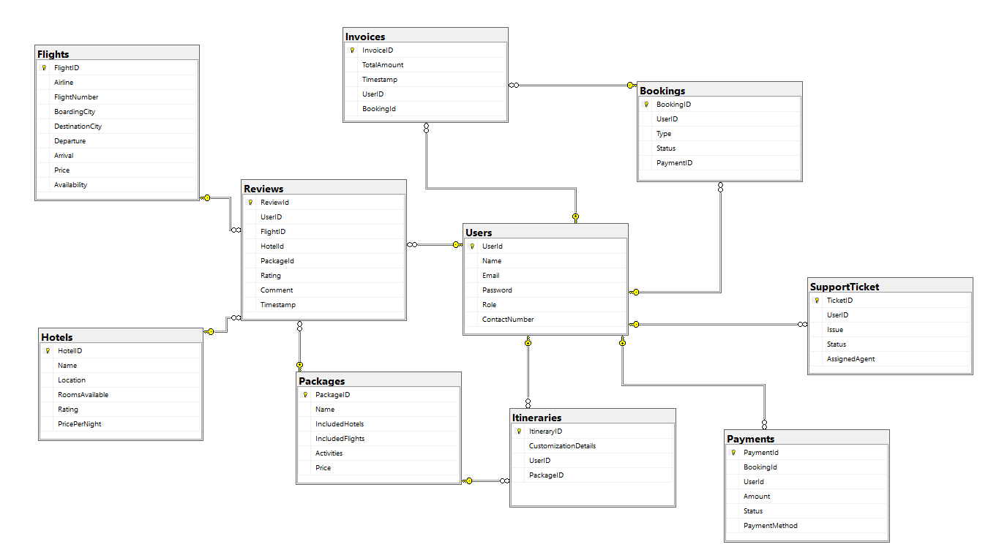

# Stayora — Online Travel and Hospitality Booking System

Stayora is a web application for booking hotels, flights, and travel packages in one place. It is organized around four user roles — **Admin**, **Traveller**, **Hotel Manager**, and **Travel Agent** — and only exposes the features each role is allowed to use.

For a fuller narrative, see [docs/ProjectOverview.md](docs/ProjectOverview.md).

## Tech Stack

- **Backend:** ASP.NET Core Web API, Entity Framework Core 8, SQL Server
- **Frontend:** Angular 21, Bootstrap 5, RxJS, ngx-toastr, SweetAlert2, html2pdf.js
- **Auth:** Role-based (Admin / Traveller / Hotel Manager / Travel Agent)

## Repository Layout

| Path | Purpose |
| --- | --- |
| [Online_Travel_and_Hospitality/](Online_Travel_and_Hospitality/) | ASP.NET Core Web API solution (`Online_Travel_and_Hospitality.sln`) and unit tests |
| [Frontend/](Frontend/) | Angular client application |
| [docs/](docs/) | Project documentation and topic guides |
| [DBSchema.png](DBSchema.png) | Database schema diagram (see below) |
| [Role Mapping.xls](Role%20Mapping.xls) | Role-to-feature mapping |
| [User Stories.docx](User%20Stories.docx) | User stories |

## User Roles

- **Admin** — manages hotels, flights, packages, reviews, and support tickets; can email users.
- **Traveller** — books hotels/flights/packages, pays online, downloads PDF invoices, builds itineraries, raises support tickets.
- **Hotel Manager** — adds/updates/removes hotels and views ratings & reviews.
- **Travel Agent** — builds custom itineraries for travellers.

## Getting Started

### Backend

```powershell
cd Online_Travel_and_Hospitality
dotnet restore
dotnet ef database update --project Online_Travel_and_Hospitality
dotnet run --project Online_Travel_and_Hospitality
```

### Frontend

```powershell
cd Frontend
npm install
npm start
```

The Angular dev server runs at `http://localhost:4200` and proxies to the Web API.

## Database Schema

The full schema diagram is in [DBSchema.png](DBSchema.png):



### Tables

The schema is implemented via EF Core in `ApplicationDbContext` — see [docs/ApplicationDbContext.md](docs/ApplicationDbContext.md) for the line-by-line walkthrough.

| Table | Key Columns | Notes |
| --- | --- | --- |
| **Users** | `UserId` (PK), `Name`, `Email`, `Password`, `Role`, `ContactNumber` | Central entity; referenced by most other tables |
| **Flights** | `FlightID` (PK), `Airline`, `FlightNumber`, `BoardingCity`, `DestinationCity`, `Departure`, `Arrival`, `Price`, `Availability` | |
| **Hotels** | `HotelID` (PK), `Name`, `Location`, `RoomsAvailable`, `Rating`, `PricePerNight` | |
| **Packages** | `PackageID` (PK), `Name`, `IncludedHotels`, `IncludedFlights`, `Activities`, `Price` | Travel bundles |
| **Bookings** | `BookingID` (PK), `UserID` (FK), `Type`, `Status`, `PaymentID` | Type indicates hotel / flight / package |
| **Payments** | `PaymentId` (PK), `BookingId`, `UserId` (FK), `Amount` (decimal 18,2), `Status`, `PaymentMethod` | `Amount` precision set in `OnModelCreating` |
| **Invoices** | `InvoiceID` (PK), `TotalAmount`, `Timestamp`, `UserID` (FK), `BookingId` (FK) | Delete on Booking/User is **Restricted** to avoid circular cascade |
| **Itineraries** | `ItineraryID` (PK), `CustomizationDetails`, `UserID` (FK), `PackageID` (FK) | Built by Traveller or Travel Agent |
| **Reviews** | `ReviewId` (PK), `UserID` (FK), `FlightID`, `HotelId` (FK), `PackageId`, `Rating`, `Comment`, `Timestamp` | A review can target a flight, hotel, or package |
| **SupportTicket** | `TicketID` (PK), `UserID` (FK), `Issue`, `Status`, `AssignedAgent` | Raised by Travellers, assigned by Admin |

### Relationships (configured in `OnModelCreating`)

- `User` 1 — many `Bookings`, `Payments`, `Invoices`, `Itineraries`, `Reviews`, `SupportTickets`
- `Booking` 1 — many `Invoices` (delete behavior: **Restrict**)
- `Hotel` 1 — many `Reviews`
- `Package` 1 — many `Itineraries`
- `Invoice` → `User` (delete behavior: **Restrict**)

## Documentation

The [docs/](docs/) folder contains topic guides used during development and interview prep:

- Project: [ProjectOverview.md](docs/ProjectOverview.md), [ApplicationDbContext.md](docs/ApplicationDbContext.md), [Program.cs.md](docs/Program.cs.md), [AuthBackend.md](docs/AuthBackend.md), [AuthService.md](docs/AuthService.md), [Sidebar.md](docs/Sidebar.md)
- Backend: [WebAPI.md](docs/WebAPI.md), [WebAPI-Project-Questions.md](docs/WebAPI-Project-Questions.md), [ASPNetCoreWebAPI_Interview_Guide.md](docs/ASPNetCoreWebAPI_Interview_Guide.md), [EFCore8_Interview_Guide.md](docs/EFCore8_Interview_Guide.md), [Advanced_DotNet_Topics.md](docs/Advanced_DotNet_Topics.md), [CSharp.md](docs/CSharp.md), [SOLID.md](docs/SOLID.md), [UnitTest.md](docs/UnitTest.md)
- Database: [SQL.md](docs/SQL.md), [Joins.md](docs/Joins.md), [AdvancedSQLServerTopics.md](docs/AdvancedSQLServerTopics.md), [SSMS-project.md](docs/SSMS-project.md)
- Frontend: [RxJS.md](docs/RxJS.md)
