# Advanced .NET Programming Topics

This guide provides simple explanations for several advanced concepts in .NET programming, followed by a mind map summarizing the relationships between the topics.

---

## 1. Advanced Object-Oriented Programming

### Design Patterns
- **Singleton**: Ensures a class has only one instance and provides a global point of access.
- **Factory**: Creates objects without exposing the instantiation logic to the client.
- **Observer**: Defines a dependency between objects so that when one changes, all dependents are notified.

### SOLID Principles
- **Single Responsibility**: Each class should have only one responsibility.
- **Open/Closed**: Classes should be open for extension but closed for modification.
- **Liskov Substitution**: Subclasses should be substitutable for their base classes.
- **Interface Segregation**: Prefer small, specific interfaces over large, general-purpose ones.
- **Dependency Inversion**: Depend on abstractions, not concrete classes.

### Dependency Injection
- **Constructor Injection**: Dependencies are provided through a class constructor.
- **Property Injection**: Dependencies are set via public properties.
- **Method Injection**: Dependencies are provided as method parameters.

---

## 2. Asynchronous Programming

### Task Parallel Library (TPL)
- **Task**: Represents an asynchronous operation.
- **Task.Run**: Runs code asynchronously on a thread pool thread.
- **Task.WhenAll/WhenAny**: Waits for multiple tasks to complete.

### Async and Await
- **Async Methods**: Methods marked with `async`, can use `await`.
- **Awaiting Tasks**: Pauses execution until the awaited task completes.
- **Handling Exceptions**: Use try-catch with async methods to handle exceptions.

### Parallel LINQ (PLINQ)
- **Parallel.ForEach**: Executes a loop in parallel.
- **Parallel LINQ Queries**: Processes LINQ queries in parallel for better performance.

---

## 3. Memory Management

### Garbage Collection
- **Generations**: Memory is divided into generations (0, 1, 2) for efficient collection.
- **Finalization**: Cleans up unmanaged resources before object is collected.
- **Weak References**: Allows the garbage collector to collect objects while still referencing them.

### IDisposable and Dispose Pattern
- **Implementing IDisposable**: Allows releasing unmanaged resources explicitly.
- **Using Statements**: Ensures `Dispose` is called automatically.

### Memory Leaks and Profiling
- **Detecting and Fixing**: Use tools to identify memory leaks and fix them.
- **Profiling Tools**: Tools like Visual Studio Profiler help analyze memory usage.

---

## 4. Advanced LINQ

### Custom LINQ Operators
- **Creating Custom Methods**: Define new LINQ methods using extension methods.

### Expression Trees
- **Building/Using Trees**: Represents code as data, useful for dynamic queries.

### Deferred Execution
- **Deferred Execution**: Query execution is delayed until the results are needed.
- **Immediate Execution**: Uses methods like `ToList()` to execute queries immediately.

---

## 5. Multithreading and Concurrency

### Threading Basics
- **Creating/Managing Threads**: Use `Thread` class to run code in parallel.

### Synchronization Context
- **Synchronization Primitives**: Tools like locks, mutexes prevent race conditions.
- **Context Switching**: Changing the thread or context in which code runs.

### Concurrent Collections
- **ConcurrentDictionary/Queue**: Thread-safe collections for multi-threaded scenarios.

---

## 6. Reflection and Dynamic Programming

### Using Reflection for Metadata Inspection
- **Inspecting Types/Methods/Properties**: Examine assemblies, types, and their members at runtime.

### Emitting IL Code
- **Dynamic Method Generation**: Create and execute methods at runtime using IL code.

### Dynamic Types and ExpandoObject
- **Dynamic Types**: Types determined at runtime.
- **ExpandoObject**: Object whose members can be dynamically added or removed.

---

## 7. Security

### Cryptography
- **Encryption**: Protects data by converting it into unreadable format.
- **Hashing**: Converts data into a fixed-size hash value.
- **Digital Signatures**: Verifies authenticity and integrity of data.

### Secure Coding Practices
- **Input Validation**: Ensure user input is safe.
- **Output Encoding**: Prevent injection attacks by encoding output.

### Authentication and Authorization
- **Implementing Authentication**: Verifies user identity.
- **Role-based Authorization**: Controls what actions users can perform based on their role.

---

## 8. Best Practices

### Code Readability and Maintainability
- **Coding Standards/Naming Conventions**: Follow consistent styles for clarity.
- **Self-Documenting Code**: Write code that explains itself.

### Error Handling
- **Exception Handling**: Use try-catch blocks to manage errors.
- **Logging**: Record information about application behavior.
- **Global Exception Handling**: Catch unhandled exceptions at the application level.

### Code Reusability
- **Modular Code**: Break code into reusable modules.
- **Interfaces/Generics**: Use interfaces and generics for flexible, reusable code.

---

# Mind Map

```mermaid
graph TD
    A[Advanced .NET Programming]
    A1[Advanced OOP]
    A2[Async Programming]
    A3[Memory Management]
    A4[Advanced LINQ]
    A5[Multithreading & Concurrency]
    A6[Reflection & Dynamic]
    A7[Security]
    A8[Best Practices]
    
    A --> A1
    A1 --> B1[Design Patterns]
    A1 --> B2[SOLID Principles]
    A1 --> B3[Dependency Injection]
    
    A --> A2
    A2 --> C1[TPL]
    A2 --> C2[Async/Await]
    A2 --> C3[PLINQ]
    
    A --> A3
    A3 --> D1[Garbage Collection]
    A3 --> D2[IDisposable/Dispose]
    A3 --> D3[Memory Leaks & Profiling]
    
    A --> A4
    A4 --> E1[Custom LINQ Operators]
    A4 --> E2[Expression Trees]
    A4 --> E3[Deferred Execution]
    
    A --> A5
    A5 --> F1[Threading Basics]
    A5 --> F2[Synchronization Context]
    A5 --> F3[Concurrent Collections]
    
    A --> A6
    A6 --> G1[Reflection]
    A6 --> G2[Emitting IL Code]
    A6 --> G3[Dynamic Types]
    
    A --> A7
    A7 --> H1[Cryptography]
    A7 --> H2[Secure Coding]
    A7 --> H3[AuthN/AuthZ]
    
    A --> A8
    A8 --> I1[Readability/Maintainability]
    A8 --> I2[Error Handling]
    A8 --> I3[Code Reusability]
```

